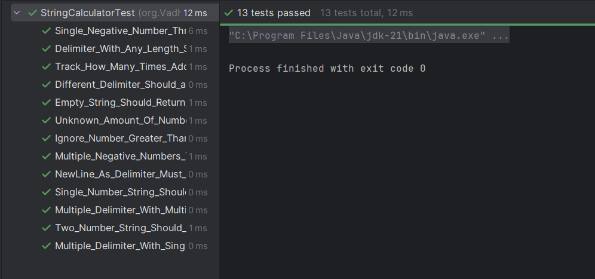

# 🧪 TDD-Based String Calculator | Incubyte Campus Placement Assignment

This project is a **TDD-first implementation** of the classic **String Calculator Kata**, submitted as part of the **Incubyte Campus Placement (Round 1)** assignment.

It demonstrates strict adherence to **Test-Driven Development**, clean Java practices, and comprehensive JUnit testing.

---## 📌 What is TDD?

> **🧪 TDD (Test-Driven Development)** is a software development methodology where you:
> 
> 1️⃣ **Write tests before writing the actual code**  
> 2️⃣ Only write code that is required to pass the test  
> 3️⃣ Continuously **refactor** and improve the implementation  

It follows a simple but powerful cycle:

🔁 **Red → Green → Refactor**

- 🔴 **Red**: Write a failing test  
- 🟢 **Green**: Write the minimum code to make the test pass  
- 🔄 **Refactor**: Clean up the code while keeping all tests green  

---

## 📐 TDD Approach Followed in This Project

This project was built **strictly using TDD** principles. Here's how I approached it:

✅ **Step-by-Step Process**:
- ✍️ Wrote **failing test cases first** (e.g., empty input, newlines, negatives, etc.)
- 🧱 Wrote just enough **code to make the tests pass**
- 🧹 Performed **refactoring after each passing test** to improve code structure
- ♻️ Repeated the cycle for each new feature

📘 **TDD Laws (by Uncle Bob)**:
> 🧑‍🏫 The Three Laws of TDD:
> 
> 1. You may not write production code unless you have a failing test.  
> 2. You may not write more of a test than is sufficient to fail.  
> 3. You may not write more production code than is sufficient to pass the test.

📚 Reference: [Three Laws of TDD by Uncle Bob](https://blog.cleancoder.com/uncle-bob/2014/12/17/TheCyclesOfTDD.html)

---


## ✅ Features Implemented

| #  | Requirement                                                                         | Status |
|----|-------------------------------------------------------------------------------------|--------|
| 1  |Return `0` for empty string                                                           | ✅ Done |
| 2  | Add method to sum 0, 1, or 2 numbers (`""`, `"1"`, `"1,2"`)                          | ✅ Done |
| 3  | Support unknown number of inputs (`"1,2,3,4"`)                                       | ✅ Done |
| 4  | Support newline as delimiter (`"1\n2,3"`)                                            | ✅ Done |
| 5  | Support custom single delimiter (`"//;\n1;2"`)                                       | ✅ Done |
| 6  | Throw exception for Single negative number (`"1,-2"` → `-2 not allowed`)             | ✅ Done |
| 7  | Throw exception for Multiple negative numbers (`"1,-2,-4"` → `-2,-4 not allowed`)    | ✅ Done |
| 8 | Show **all** negative numbers in exception message                                    | ✅ Done |
| 9  | Add `GetCalledCount()` method to track `Add()` calls                                  | ✅ Done |
| 10  | Ignore numbers greater than 1000 (`"2,1001"` → returns 2)                             | ✅ Done |
| 11 | Support multi-character delimiters like `[***]`                                       | ✅ Done |
| 12 | Support multiple single-char delimiters like `[;][*]`                                 | ✅ Done |
| 13 | Support multiple multi-char delimiters like `[**][%%]`                                | ✅ Done |

---

## 🧪 All Tests Passed ✅

Here’s a screenshot showing all my tests successfully passing:

> 🖼️ **Insert your screenshot below this line**  
> *(e.g., IntelliJ JUnit test results or terminal `mvn test` results)*



---

## 💡 Sample Inputs & Outputs

| Input String                          | Expected Output / Behavior                |
|--------------------------------------|-------------------------------------------|
| `""`                                 | `0`                                       |
| `"7"`                                | `7`                                       |
| `"1,2"`                              | `3`                                       |
|`"1,3,6,2"`                           | `12`                                      | 
| `"1\n2,3"`                           | `6`                                       |
| `"//;\n1;2"`                         | `3`                                       |
|`"1,-2"`                              | Exception: `negative not allowed: -2`     |
|`"1,-2,-4"`                           | Exception: `negative not allowed: -2,-4`  |
| `"2,1001"`                           | `2`                                       |
| `"//[***]\n1***2***3"`               | `6`                                       |
| `"//[*][%]\n1*2%3"`                  | `6`                                       |
| `"//[**][%%]\n1**2%%3"`              | `6`                                       |


---


## 📁 Project Structure

```
TDD-Assesment_Incubyte/
├── src/
│   ├── main/
│   │   └── java/org/VadhelMilan/
│   │       └── StringCalculator.java         ← Core logic implementation
│   └── test/
│       └── java/org/VadhelMilan/
│           └── StringCalculatorTest.java     ← All JUnit test cases
├── screenshots/
│   └── all-tests-pass.png                    ← Screenshot of successful test run
├── pom.xml                                   ← Maven build configuration
└── README.md                                 ← Project documentation (you’re reading it!)
```


📦 The structure supports easy testing, modularity, and clean separation of logic and tests — following best software engineering practices.

---

## 🧱 Technology Stack

This project is built using industry-standard tools and libraries:

| 🔧 Component     | 💡 Description                                      |
|------------------|-----------------------------------------------------|
| ☕ **Java 21**     | Primary programming language                        |
| ✅ **JUnit 4.13.2**| Testing framework for all unit tests               |
| 🧰 **Maven**       | Build automation and dependency management tool     |
| 📏 **Regex**        | Used (`Pattern`, `Matcher`) to extract custom delimiters dynamically |

This lightweight and powerful tech stack enables rapid test-driven development and clean, maintainable code.

---

---

## 🙏 Thank You

Thank you **Incubyte** for this opportunity.  
This assignment helped me sharpen my skills in **TDD**, **clean code**, and **unit testing**.  
I genuinely enjoyed learning and applying **Test-Driven Development** throughout this project.


With gratitude,  
**👨‍💻 Milan Vadhel**  

